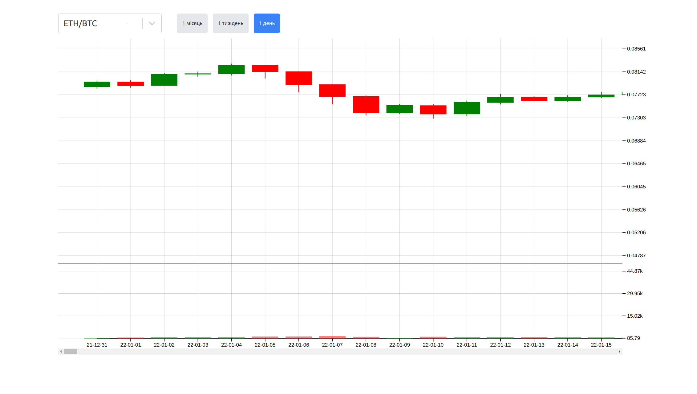
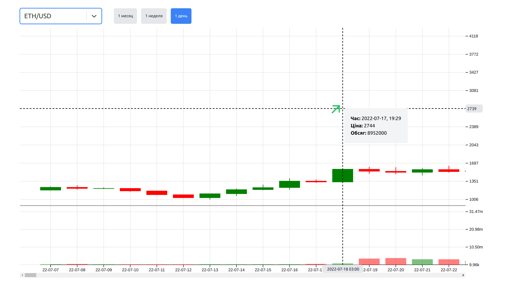
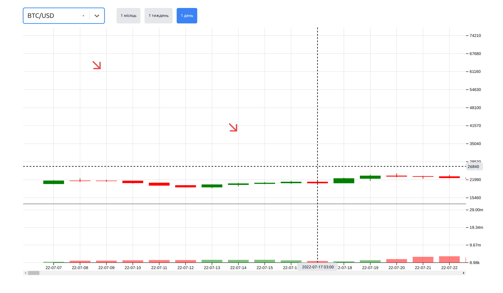

# tt-apex-tech

# Trading Data Visualization Web Application

This web application is developed using React to visualize candlestick data fetched from the Whitebit API. It also generates random buy and sell signals for the given period.

## Features

- Displays candlestick data from the Whitebit API for a specific currency pair (e.g., BTC/USDT).
- Generates random buy and sell signals within the specified time period.

## Requirements

- Node.js and yarn installed.

## Installation

1. Clone this repository:

```bash
git clone https://github.com/Dima9119708/tt-apex-tech
```

2. Install dependencies
```bash
yarn install-all
```

3. Start the project
```bash
yarn dev
```

4. Screenshots



